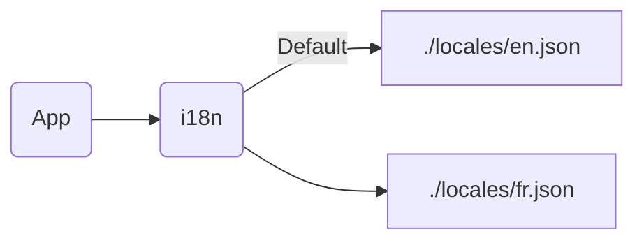
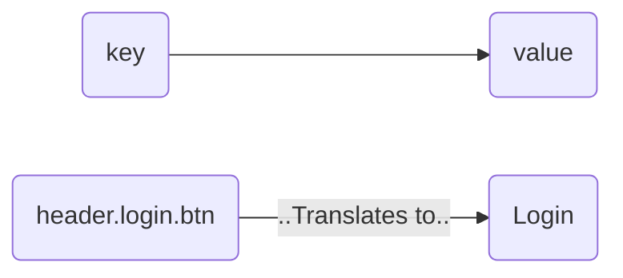
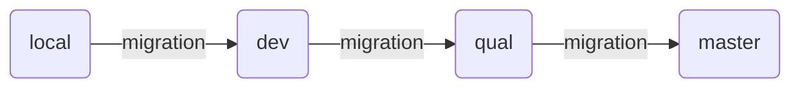

# Automate everything (n8n)

Automate Everything with Open Source Workflows

<div class="pt-12">
  <span @click="$slidev.nav.next" class="px-2 py-1 rounded cursor-pointer" hover="bg-white bg-opacity-10">
    <carbon:arrow-right class="inline"/>
  </span>
</div>

<div class="avtar mt-36 rounded-full flex w-full align-center justify-center ">
  

  <a class="text-left ml-4 mt-2" href="https://github.com/sayjeyhi">
    <strong class="text-xl">Jafar Rezaei</strong> <br/>
    <span class="text-gray-400 text-sm">May 2025</span>
  </a>
</div>

---


# What is N8N?

<div class="grid grid-cols-2 gap-x-4">
<div>

- N8N stands for "Node-Node"

- Open-source workflow automation tool

- Alternative to Zapier, Make.com

- Supports over 300 integrations and growing

- Can be self-hosted or cloud-based

</div>

<div>

</div>
</div>

---

# What is Internationalization?

> Also known as **i18n**

**Definition:** The process of designing and developing a product, application, or website so that it can be easily adapted to different languages, regions, and cultures without requiring significant changes to the codebase.

**Key Focus:** Making the software flexible and adaptable for multiple <span v-mark="{ color: '#95a312', type: 'box' }">locales</span>.

**Examples:**

- Using Unicode to support multiple character sets.
- Separating translatable text from the code (e.g., using language files).
- Supporting right-to-left (RTL) and left-to-right (LTR) text layouts.
- Designing UI elements that can adjust based on text length and direction.

---

# Locales

> Also known as **i18n**

Locale code is used to identify a specific language or region.
ISO standardized locale codes are a combination of a language code and a country code.

**Examples:**

- en-US (English, United States)
- fr-FR (French, France)
- be-NL (Belgium, Netherlands)
- be-FR (Belgium, France)

So:

- {LANGUAGE_CODE}-{COUNTRY_CODE}

---

# Then what is Localization?!

> Usually, localization is a process of adapting a product or service to a specific language or region.

<br />

|              | **Internationalization (i18n)**                       | **Localization (l10n)**                                     |
|--------------|-------------------------------------------------------|-------------------------------------------------------------|
| **Purpose**  | Prepares software for multiple languages and cultures | Adapts software for a specific language or region           |
| **Scope**    | Development phase (code-level implementation)         | Deployment phase (content and UI adaptation)                |
| **Involves** | Code structure, UI flexibility, encoding              | Translation, cultural adaptation, formatting                |
| **Example**  | Using placeholders for text ("Hello, {name}!")        | Replacing "Hello, {name}!" with "Hola, {name}!" for Spanish |

---

# Decide on a locale
> How to decide on a locale code

<div class="text-yellow text-xl flex flex-col mt-10">
  https://www.sample.nl/en
</div>

**Country code**: <span class="text-yellow">NL</span>

**Language code**: <span class="text-yellow">??</span>

<div class="ml-4 grid grid-cols-2 border-b-1 border-dashed border-gray-300 p-2 text-base"> 
  <span class="text-gray-400">Query parameter: </span>
  <span class="text-yellow">en</span>
</div>
<div class="ml-4 grid grid-cols-2 border-b-1 border-dashed border-gray-300 p-2 text-base"> 
  <span class="text-gray-400">Cookie: </span>
  <span class="text-yellow">en</span>
</div>
<div class="ml-4 grid grid-cols-2 border-b-1 border-dashed border-gray-300 p-2 text-base"> 
  <span class="text-gray-400">Browser language: </span>
  <span class="text-yellow">nl</span>
</div>
<div class="ml-4 grid grid-cols-2 border-b-1 border-dashed border-gray-300 p-2 text-base"> 
  <span class="text-gray-400">TLD supported languages: </span>
  <span class="text-yellow">[nl, en]</span>
</div>
<div class="ml-4 grid grid-cols-2 p-2 text-base"> 
  <span class="text-gray-400">Fallback after all: </span>
  <span class="text-yellow">en</span>
</div>

---


# Wider view

- **Globalization (g11n)**: The process of extending the reach of an organization's products <span v-mark="{ color: '#95a312', type: 'box' }">beyond</span> a <span v-mark.underline.orange>specific region</span>, language or culture, to deliver those products to a wider market.
- **Localization (l10n)**: adapting and customizing an internationalized product for <span v-mark.box.orange>one</span> or <span v-mark.box.orange>more target</span> markets. Localization takes into account language, culture, expectations, local standards and legal requirements, among other factors.

<br/>

- **Internationalization (i18n)**: accommodate different <span v-mark="{ color: '#95a312', type: 'highlight' }">language conventions</span>, <span v-mark="{ color: '#95a312', type: 'highlight' }">date</span> and <span v-mark="{ color: '#95a312', type: 'highlight' }">time formats</span>, and formatting instructions.
- **Translation (t9n)**: translating all readable text into the language of the target audience. This includes UI components, product labels, and supporting documentation.


---


---

# Simple i18n implementation

> having a language file per locale/domain and a default locale.

<br/>
<br/>



---

# Challenges of simple i18n

<br/>
<br/>

- No possibility to edit translations without changing the code
- Not the best experience for translators
- No dashboard to manage translations
- Hard to compare translations
- Needs manual translations
- Not possible to have screen shots of the translation keys

<br />

<div class="flex gap-2 text-sm items-center bg-gray-900 p-2 border-l-4 border-solid border-gray-300 rounded">
   
    It has advantages as as well, and it is still a valuable option to have for simple projects.
</div>

---

# Solutions

- tolgee
- localizejs
- lokalise
- contentful
- etc...

---

<div class="text-sm">

|                           | **Lokalise** 🏆                          | **Tolgee** 🔧                 | **Custom Contentful App** ⚙️                                 |  
|---------------------------|------------------------------------------|-------------------------------|--------------------------------------------------------------|  
| **Type**                  | SaaS Platform                            | Open-source & SaaS            | Fully Custom                                                 |  
| **CMS Integration**       | ✅ Yes (Contentful, GitHub, Figma)        | ✅ Yes (GitHub, Figma)         | ✅ Full control via API                                       |  
| **CMS Migrations**        | ❌ Limited                                | ❌ Limited                     | ✅ Fully controlled                                           |  
| **Automated Translation** | ✅ AI-based (Google, DeepL)               | ✅ AI-based (Google, DeepL)    | ✅ can have All integrations                                  |  
| **Collaboration**         | ✅ Role-based access, workflows           | ✅ Developer-friendly UI       | ✅ Customizable                                               |  
| **Self-Hosting**          | ❌ No                                     | ✅ Yes (Docker-based)          | ✅ Yes                                                        |  
| **Ease of Access**        | ✅ User-friendly UI                       | ✅ User-friendly UI            | ❌ Requires UI development                                    |  
| **Best For**              | Enterprises needing managed localization | Dev teams needing flexibility | Companies wanting full control & integration with Contentful |  

</div>

---

# Key Takeaways

- **Lokalise**: 
  - Best for enterprises needing <span v-mark="{ color: '#95a312', type: 'underline' }">scalable, managed localization</span> with a CMS.

- **Tolgee**: 
  - Great for <span v-mark="{ color: '#95a312', type: 'underline' }">developer-centric teams</span> wanting <span v-mark="{ color: '#95a312', type: 'underline' }">open-source/self-hosted</span> solutions.

- **Custom App with Contentful**: 
  - Ideal for teams needing <span v-mark="{ color: '#95a312', type: 'highlight' }">complete control over content workflows</span>, <span v-mark="{ color: '#95a312', type: 'highlight' }">seamless API integration</span>, and <span v-mark="{ color: '#95a312', type: 'highlight' }">flexibility in CMS migrations</span>.


---

# Contentful?

<div class="grid grid-cols-2 gap-4">

<div>


- **Headless CMS**
  - Flexible API-based content management
- **Multi-language support**
  - Built-in locale management
- **Integration possibilities**
  - Custom apps for automation
- **Scalability**
  - Suitable for enterprise-grade applications
- **SDK**
  - Contentful SDK for developers

</div>


<div class="ml-4">

</div>

</div>


---

# Setting Up Localization in Contentful

> For regular contents, Contentful provides a simple UI for managing content in multiple locales.

<div class="grid grid-cols-2 gap-4 pt-8">

<div>

<b>Step 1: Define Locales</b>


- In Contentful, go to **Settings → Locales**
- Add supported languages (e.g., English, French)
- Set a **default locale** (e.g., `en-US`)


</div>

<div>

<b>Step 2: Enable Field-Level Localization</b>

- In content models, enable **"Localization"**


</div>

</div>

<div v-click class="flex align-center justify-center mt-5">
  
</div>

---


# Implementing a custom Solution

<br/>

<span class="text-yellow text-2xl font-bold"> We wanted to have:</span>


<br/>

- ✅ Same DX as local development
- ✅ Full control over the translations
- ✅ Full control over the content workflows
- ✅ Seamless integration with Contentful
- ✅ A self-hosted solution
- ✅ Migrations possibility

---


# Translations

> Each translation is a key-value pair that maps a field to a value in a specific locale.


<div class="flex align-center justify-center mt-5">



</div>


```json
// en.json
{
    "header": {
        "login": {
            "btn": "Login"
        }
    }
}
```


---

# Migrations


<div class="flex align-center justify-center mt-12">

```mermaid {theme: 'default', scale: 0.8, 'themeVariables': {'git0': '#ff0000', 'git1': '#00ff00','git2': '#408af7','git3': '#ff00ff'}, 'gitGraph': {'showBranches': true, 'showCommitLabel':true} }
  gitGraph
    branch localhost/featenv
    commit id:"feature a"
    commit id:"feature b"
    commit id:"feature c"
    commit id:"feature d"
    commit id:"feature e"
    branch dev.site.com
    commit id:"Merge pr #34"
    commit id:"Merge pr #35"
    branch qual.site.com
    commit id:"Stable 1.2.0"
    commit id:"Stable 1.3.0"
    branch site.com
    checkout qual.site.com
    commit id:"Stable 1.4.0"
    commit id:"Stable 1.5.0"
    checkout site.com
    commit id:"Stable 1.2"
    commit id:"Stable 1.3"
    commit id:"hotfix 1.3.4"
    checkout dev.site.com
    commit id:"feature i"
    commit id:"feature j"
    commit id:"feature k"
    checkout localhost/featenv
    merge dev.site.com tag:"Current Master"
```

</div>

---

# Migrations


<div class="mt-8 flex gap-2 text-sm items-center bg-gray-900 p-2 border-l-4 border-solid border-gray-300 rounded">
   
    Contentful has also a <span v-mark.underline.orange>SDK API</span> for developers allows having migrations
</div>

<div class="flex align-center justify-center mt-12">

- Contentful has environments so we created (dev, qual, master)
- Mapped cms envs to git envs
- We had migration setup for cms
- Contents are live and editors can be editing them anytime.

</div>

<div v-click class="flex align-center justify-center mt-12">




</div>

---

# Keys on contentful

- has special content models to store keys
- supports types of keys
- supports screenshots of the keys
- allows adding descriptions

---

# Key Model


---

# Key content


---

<span class="flex flex-col text-center center items-center justify-center h-full text-[30px]">

Automatically generate keys by comparing<br/><br/> dev files (`en.json`) with contentful keys
as part of 
   <div class="text-yellow-500 text-[70px] mt-12 font-extrabold ">Migrations!</div>

</span>

---

<div class="flex flex-col text-center center items-center justify-center h-full text-[20px]">

Now we have keys on contentful, we need to have a way to translate them.

</div>

---

# Building a Custom Translation App

<div class="grid grid-cols-2 gap-4">

<div>

<br/>

### **Why Use a Custom App?**

<br/>

- Automate translations via migrations
- Provide seamless UI for editors
- Store translation history
- Improve accuracy by validating translations
- Support easier filtering of translations
- Support screen shots of the translation keys
- Allow import/export of translations


</div>

<div>

<br/>

### **Tech Stack**

<br/>

- Using contentful custom app starterkit
- f36 components
- react with contentful sdk

</div>

</div>

---


# Our current app


---

# Our current app


---

# GraphQL API

We use GraphQL to fetch the translations from the Contentful API.
```graphql
query {
  translationCollection(locale: "fr-FR") {
    items {
      ...keyValuePair
    }
  }
}
```

And combine it with graphql-codegen to generate the types and request functions.

```bash
npx graphql-codegen
```

<a href="https://github.com/dotansimha/graphql-code-generator" class="text-sm mt-6 inline-block">
https://github.com/dotansimha/graphql-code-generator
</a>


---

# Caching the translations

> We use Redis to cache the translations

<br/>
<br/>
<br/> 

- Redis is a key-value store
- We fetch the translations from the Contentful API
- Store the translations in Redis
- When the translations are requested, we fetch them from Redis

---

<div class="flex align-center flex-col items-center mt-12">


# Thank You!

[GitHub](https://github.com/sayjeyhi) · [My Website](https://sayjeyhi.com)

</div>
