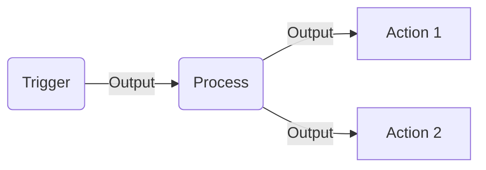

# Automate everything (n8n)

Automate Everything with Open Source Workflows

  
    <carbon:arrow-right class="inline"/>
  

  

  <a class="text-left ml-4 mt-2" href="https://github.com/sayjeyhi">
    <strong class="text-xl">Jafar Rezaei</strong>  
    May 2025
  </a>

---
layout: center
class: text-center
---

Almost everything we do follows a flow

---
layout: center
class: text-center
---

It doesn't mean that

---
layout: center
class: text-center
---

--- 

# Tools to handle automation

 
 

- n8n
- airflow
- node-red
- tray.io
- make.com
- zapier
- parbola
- ...

---

## 🔧 Open-Source Tools Comparison

| Tool         | Visual Interface | Coding Required | Flexibility   | Best For                             |
|--------------|------------------|------------------|---------------|---------------------------------------|
| **n8n**         | ✅ Yes            | ⚠️ Optional         | ✅ High        | General automation, APIs, custom logic |
| Node-RED     | ✅ Yes            | ⚠️ Minimal          | ⚠️ Medium      | IoT, home automation                  |
| Apache Airflow | ❌ No             | ✅ Required         | ✅ Very High   | Data engineering, scheduling          |
| Huginn       | ❌ Minimal        | ✅ Required         | ⚠️ Medium      | Personal data agents                  |
| Activepieces | ✅ Yes            | ❌ Low              | ⚠️ Moderate    | Simpler UI, early-stage tool          |

---

## 🌐 Cloud-Based Tools Comparison

| Tool        | Visual UI | Self-Hosted | App Integrations | Custom Logic      | Pricing Model              |
|-------------|-----------|-------------|------------------|-------------------|-----------------------------|
| **n8n**        | ✅ Yes     | ✅ Yes        | ⚠️ Growing         | ✅ JavaScript/functions | Free & paid (open source)   |
| Zapier      | ✅ Yes     | ❌ No         | ✅ Massive         | ❌ Minimal            | Paid tiers, usage-based     |
| Make (Integromat) | ✅ Yes | ❌ No         | ✅ Wide            | ⚠️ Limited scripting  | Usage-based plans           |
| Pipedream   | ✅ Yes     | ❌ No         | ✅ Good            | ✅ Node.js focused     | Generous free tier          |

---

## ✅ Summary: Where n8n Stands

### Strengths
- ✅ Open source and self-hostable
- ✅ Powerful for both developers and no-coders
- ✅ Supports custom logic and scripting
- ✅ No forced step limits (unlike Zapier)

### Weaknesses
- ⚠️ UI less polished than Zapier/Make
- ⚠️ Smaller integration library (but growing)
- ⚠️ Slightly steeper learning curve than no-code tools
- ⚠️ Needs setup for production use

---

# We Chose n8n

## n8n vs Alternatives: How It Compares

n8n sits **in the middle ground** between developer-heavy tools and no-code platforms. It blends visual workflows with the power to code when needed.

n8n is the **best balance** for teams who want the **freedom of code with visual simplicity**, without the limitations of commercial SaaS tools.

---

# What is N8N?

- N8N stands for "Node-Node"

- Open-source workflow automation tool

- Alternative to Zapier, Make.com

- Supports over 300 integrations and growing

- Can be self-hosted or cloud-based

---

# How N8N Works?

 

## Workflow Triggers

 

- Button clicks
- Chat messages
- Form submissions
- Webhooks
- Scheduled events

## Data Flow

 

- Input → Process → Output
- Transform data between steps
- Built-in `$fromAI` function
- Variables for dynamic data

---

---

# Core Features

 

## Data Operations

 

- Filter nodes
- Switch routing
- Merge multiple streams
- Iterate over items
- ...

## Common Integrations

 

- Google Sheets
- Calendar apps
- CRM systems
- Email services
- Chat platforms
- ...

---
layout: center
class: text-center
---

Let's jump into it...

---

# Thank You!

Slides: <a href="https://n8n.catshoulder.dev" class="text-blue-400">n8n.catshoulder.dev</a>

[GitHub](https://github.com/sayjeyhi) · [My Website](https://sayjeyhi.com)

